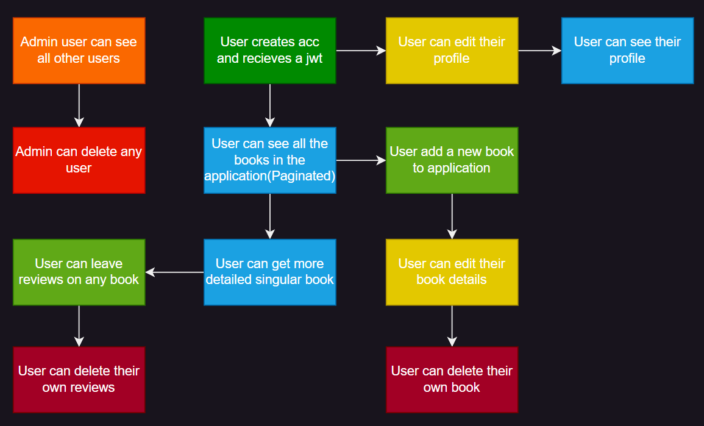
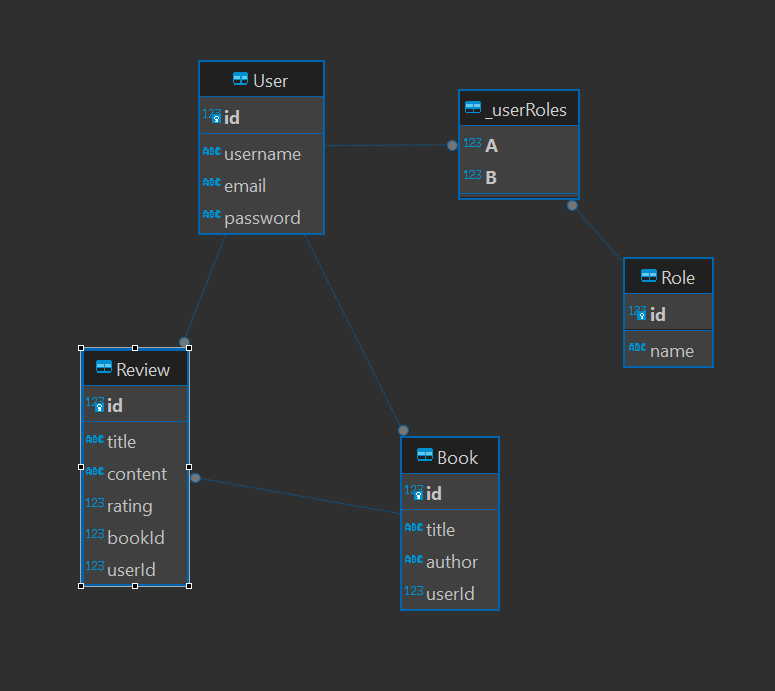

# Book Review API

This is a RESTful API for a book review application that allows users to create an account, add books, and leave reviews on books. The application also provides an admin interface for managing users. The API is built using Node.js, Express, and Prisma ORM. For my Database I used PostgreSQL running in Docker.

## Application Features

<div style="text-align: center;">
  
</div>

Our application provides a variety of features for users and administrators, enhancing the overall user experience and allowing efficient management of books and reviews. Below is a brief overview of the main features and actions that can be performed in the application:

### User Features

- **Account Creation**: Users can create an account/login into an account and receive a JWT token for authentication.
- **Profile Management**: Users can edit and view their profiles.
- **Book Management**:
  - Users can add new books to the application.
  - Users can edit the details of their books.
  - Users can delete their own books.
- **Review Management**:
  - Users can leave reviews on any book.
  - Users can delete their own reviews.
- **Book Browsing**:
  - Users can see all books in the application with pagination support.
  - Users can view detailed information about a specific book.

### Admin Features

- **User Management**:
  - Admin users can see all other users.
  - Admin users can delete any user.

## Database Schema and Relationships

<div style="text-align: center;">
  
</div>
The database schema consists of four main models: User, Role, Book, and Review. Below is a brief explanation of the relationships between these models. I used prisma orm to define the relationships between the models. I also used prisma client to interact with the database in my controllers and services.

### User

- **One-to-Many with Book**: Each user can own multiple books.
- **One-to-Many with Review**: Each user can write multiple reviews.
- **Many-to-Many with Role**: Users can have multiple roles, and each role can be assigned to multiple users.

### Role

- **Many-to-Many with User**: Each role can be assigned to multiple users, and users can have multiple roles.
- As seen on the diagram prisma automatically creates a join table `_userRoles` to manage the many-to-many relationship between `User` and `Role`.

### Book

- **Many-to-One with User**: Each book is owned by a single user.
- **One-to-Many with Review**: Each book can have multiple reviews.

### Review

- **Many-to-One with Book**: Each review is associated with a single book.
- **Many-to-One with User**: Each review is written by a single user.

## Project Structure

Our project follows a well-organized structure to maintain clean and manageable code. Below is an overview of the main components and how they interact with each other.

### Overview

1. **App Initialization**: The `app.js` file is the entry point of the application where endpoints are configured.
2. **Routing**: Endpoints defined in `app.js` are routed to specific handlers located in the `routes` folder.
3. **Controllers**: The `routes` handlers delegate the logic to controllers in the `controllers` folder.
4. **Services**: Business logic and data manipulation are handled by services located in the `services` folder.
5. **Validation**: Input validation rules for endpoints are defined in the `validators` folder. I used `express-validator` to validate the input data.
6. **Middleware**: Custom middleware functions are stored in the `middleware` folder.
7. **Error Handling**: Custom error models and the global error handler are located in the `errors` folder.

## Middleware

Our application utilizes several middleware functions to enhance functionality, manage requests, and handle errors efficiently. Below is an overview of the middleware used in the application.

### Non-Custom Middleware

1. **express**: A minimal and flexible Node.js web application framework that provides a robust set of features to develop web and mobile applications.
2. **morgan**: HTTP request logger middleware for Node.js. It logs details about incoming requests for debugging and monitoring purposes.
3. **cors**: Middleware to enable Cross-Origin Resource Sharing (CORS). It allows servers to specify who can access resources on the server from different origins.
4. **dotenv**: Loads environment variables from a `.env` file into `process.env`, allowing for secure storage of configuration settings.
5. **express.json()**: Middleware to parse incoming requests with JSON payloads.
6. **express.urlencoded()**: Middleware to parse incoming requests with URL-encoded payloads.

### Custom Middleware

In addition to the non-custom middleware, our application also includes several custom middleware functions to handle specific requirements:

1. **globalErrorHandler**: A custom global error-handling middleware that catches and processes all errors occurring in the application, sending appropriate responses to the client.

   ```javascript
   app.use(globalErrorHandler);
   ```

2. **authenticateToken**: Middleware that authenticates JWT tokens to ensure that requests are made by authenticated users.

   ```javascript
   app.use(authenticateToken);
   ```

3. **roleCheck**: Middleware that checks the roles of authenticated users to enforce access control and permissions.

   ```javascript
   app.use(roleCheck(["admin"]));
   ```

## Running the Application

To run the application after installing the dependencies, you can use the following command from the root directory of the project:

```bash
node ./server/app/app.js
```

## Testing the API

I used swagger OpenAPI to document the API endpoints and test them. You can access the API documentation by visiting the following URL: [http://localhost:3000/swagger](http://localhost:3000/swagger)
